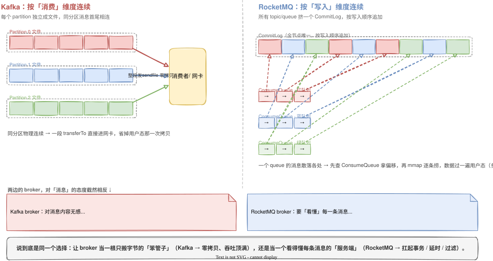

「Kafka 比 RocketMQ 快」是面试和选型里反复出现的一句话。它不算错，但单拎出来会误导人——快是有前提的，换个场景结论就反过来。

更有意思的是，把「为什么快」这件事顺着往下挖，会发现快和慢都不是某个优化技巧抠出来的，而是两套存储模型在同一个约束下做了相反的取舍，各自把一头做到了极致。这篇就借这个问题，把 Kafka 和 RocketMQ 的存储原理一次讲透。

## 先把「更快」这句话收窄

Kafka 吞吐更高，成立的前提是：topic 和分区数不太多、追求的是吞吐。

一旦反过来——topic 或 queue 的数量涨到成千上万，Kafka 会掉队。原因后面会讲清楚：它每个分区一个独立文件，分区一多，磁盘上就是几千个文件同时写，顺序写退化成随机写。而 RocketMQ 在这种场景下反而稳得很。

所以这篇真正要回答的不是「谁快」，而是一句更值钱的话：

> 两套存储模型，各自把哪一头做到了极致，又把哪一头当成了代价。

「快」只是这个取舍在某一类 benchmark 上的投影。

## 分叉点：消息落到磁盘的那一刻

两者的所有差异，都从「一条消息怎么落盘」开始分岔。

**Kafka 按分区存。** 每个 partition 是一组独立的 log 文件，同一个分区的消息，在磁盘上首尾相接、物理连续。

**RocketMQ 按写入顺序存。** 整个 broker 只有一个 CommitLog，所有 topic、所有 queue 的消息，不分彼此地往这一个文件后面追加。至于「某个 queue 都有哪些消息」，靠另一份轻量索引 ConsumeQueue 记录——每条索引只有 20 字节：8 字节记消息在 CommitLog 里的物理偏移，4 字节记消息长度，8 字节记 tag 的哈希值。

两句话对照着看，分水岭就清楚了：

> Kafka 让「同一个消费单元的消息」在磁盘上连成一片；RocketMQ 让「所有写入」在磁盘上连成一片。

两个「连续」指向的维度不一样——一个朝着消费，一个朝着写入。后面所有的快慢之分，都是这一刀切下去的回声。

## 那次拷贝：Kafka 快最常被引用的地方

讲 Kafka 快，绕不开「零拷贝」。

消费者拉数据时，Kafka 走的是 `sendfile`：数据从操作系统的 page cache 直接进网卡，**不经过用户态**，省掉了「内核态拷到用户态、再拷回内核态」这一来一回。副本之间的复制也走同一条路。

RocketMQ 消费走的是另一条路——`mmap` 加 write：先把 CommitLog 映射进内存读出来，再写给 socket，数据要在用户态过一遍，比 sendfile 多一次拷贝。

关键问题来了：**RocketMQ 为什么不也用 sendfile？**

表面上的答案是「数据不连续」。`sendfile` 的本事，是把文件里一段**连续区间**整体怼给网卡——

- Kafka 一个分区的消息，在它自己的 log 文件里本就连续，一个消费者要读的那段，整段 `transferTo` 就发出去了；
- RocketMQ 一个 queue 的消息，散落在 CommitLog 各处，和别的 queue 的消息交错着，得先查 ConsumeQueue 拿偏移、再一条条回 CommitLog 里捞，根本凑不出「一段连续区间」。

但这只是表象。再往下问一层：RocketMQ 为什么甘愿是这种散落布局、甘愿多还这一次拷贝？

因为它是**业务消息中间件**，broker 本来就得「看懂」每一条消息。tag 过滤要在服务端按消息的标签筛掉一批，事务消息要按提交状态决定投不投，延时消息要掐着点才投递——这些业务能力，全都建立在「每条消息能被单独定位、单独处理」之上。消息对 RocketMQ 的 broker 来说不是一段不透明的字节，而是带语义、要逐条过手的单元。

而 `sendfile` 恰恰要求**数据原样搬运、broker 不许插手**：数据一旦要被加工，零拷贝就用不了。一个要逐条看懂、过滤、按状态投递消息的 broker，本就和「闭眼把一段字节整体转发出去」互斥。Kafka 的 broker 反过来——对消息内容无感，只当字节流整段搬走，这才是它能 sendfile 的前提。

所以那次多出来的拷贝，根上不是「文件没排整齐」，而是 RocketMQ 选择让 broker 理解消息，好把事务、延时、过滤这些业务能力扛起来。散落的存储布局，只是这个选择落到磁盘上的样子。

> Kafka 让 broker 对消息无感，于是能整段零拷贝、把吞吐顶满；RocketMQ 让 broker 看懂每条消息，于是扛得起事务、延时、过滤，代价是消费时逐条过手、多一次拷贝。快与慢，是「broker 要不要懂消息」这个选择的影子。

## 顺带一笔：批量与压缩

「消息要被逐条对待」这件事，不只发生在 broker 端，客户端发消息这头也留下了痕迹。

Kafka 的客户端默认按分区**攒批**，整批一起压缩，broker 端不解压、直接把压缩块落盘，到消费端才解压。网络和磁盘搬的都是压缩后的大块，单条消息的固定开销被摊薄——这是它高吞吐的另一根支柱。

RocketMQ 历史上以**单条发送**为主（后来有批量，但约束多、用得弱）。它把单条消息当一等公民，正是因为事务消息、延时定时、消息回溯、tag 过滤这些业务特性，都建立在「每条消息能被单独寻址、单独处理」之上。

同一个取舍的两面：Kafka 牺牲单条消息的精细可控，换吞吐；RocketMQ 牺牲极限吞吐，换单条消息的业务表达力。

## 把账算总

把两边的选择摆在一起，没有谁更先进，只有两条不同的路：

| 维度 | Kafka | RocketMQ |
|---|---|---|
| 存储 | 每分区一个 log，按**消费维度**连续 | 单 CommitLog，按**写入维度**连续 |
| 写入 | 分区多了 → 多文件随机写，吞吐反降 | 不管多少 topic，永远是一个文件顺序追加 |
| 消费 | 整段 `sendfile` 零拷贝 | ConsumeQueue 二次寻址 + `mmap`，多一次拷贝 |
| 消息 | 强批 + 压缩，单条语义弱 | 单条为一等公民，事务/延时/回溯/过滤好做 |
| 定位 | 日志流、大数据管道，吞吐王 | 业务消息中间件，重可靠与复杂语义 |

Kafka 把「连续」押在消费侧，于是白嫖了零拷贝、把吞吐顶到天花板，代价是 topic 一多写入就塌。RocketMQ 把「连续」押在写入侧，于是海量 topic 也不慌、单条消息能玩出花，代价是消费时要还一次拷贝的债。

## 总结

回到最初那句「Kafka 比 RocketMQ 快」。它真正的含义是：在「为吞吐优化」这条路上，Kafka 走得更远——但那是一条路，不是一个排名。RocketMQ 走的是「为业务语义和规模优化」的另一条路，在它的场景里，那次多出来的拷贝换回了实打实的东西。

往下抽一层，会发现这两套设计争的，其实是同一样稀缺资源：

> **「连续」（也就是局部性）只有一份，写入维度和消费维度只能要一头。**

把它给谁，谁那一侧就便宜、就快；另一侧就得绕路、还债。而连续到底押在哪一头，背后连着一个更根本的选择：让 broker 当一根又快又笨、只管搬字节的管子，还是当一个看得懂每条消息、扛得起事务与延时的服务端。这和[《加机器最怕搬数据》]()里问的是同一类问题——一个操作贵在哪，往往不在操作本身，而在某个更早的设计决定，把「连续」分给了哪个维度。看系统设计，与其问「谁更快」，不如问「它把这份连续，押在了哪一头」。
