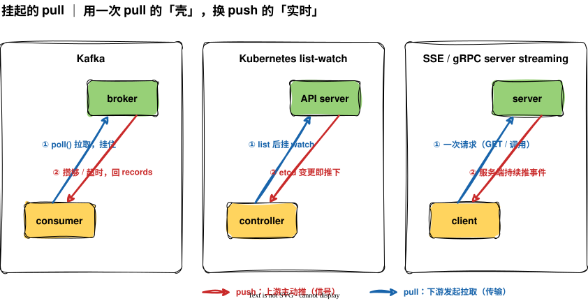
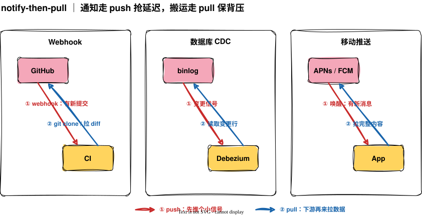

上一篇[《谁控制时机：重新理解 push 与 pull》]()里，我把结论落在一句话上：先问负载在乎什么，再看哪一端的知识更难传过去，答案自然就出来。听起来像是让你二选一。

可真去翻那些天天在用的系统，会发现它们大多没在二选一。Kafka 的消费者明明是去 pull，却几乎没有空轮询；你手机上的 App 收到一条推送，点开却要转半天圈才加载出内容。它们都既有 push 的影子，又有 pull 的骨架。这篇就接着上一篇往下走：为什么纯 push、纯 pull 的系统这么少，混着用到底混的是什么。

## 一次数据流动，其实是两个动作

上一篇有个隐含的预设一直没说：我们默认「数据流动」是一个动作。push 是这一个动作由上游发起，pull 是由下游发起，二者择其一。

但把它拆开看，一次数据流动其实是两件事接在一起：先有一个**信号**——「有新东西了」，再有一次**传输**——「把这坨数据搬过去」。平时它们粘在一起，所以你以为只有一个动作。一旦拆开，关键的事情就来了：这两个动作对延迟和背压的诉求，根本不一样。

信号要的是快。有没有新数据这件事，越早知道越好，而它本身很轻，就是一个比特的事，「有」或「没有」。

传输要的是稳。真正的数据可能很大、下游可能正忙，搬运得讲背压、讲流控，急不得。

诉求不一样，就没有理由非得用同一种模式。**信号轻、要快，交给 push；传输重、要稳，交给 pull。** 把这两个动作分开下注，就是几乎所有「混合」的来路。下面两种范式，本质都是这一句的变体。

## 范式一：挂起的 pull

第一种混法，是让 pull 把信号也一起等了。

普通轮询的浪费在哪？在于下游问「有活吗」，上游立刻答「没有」，然后下游隔几秒再来问一遍。大部分请求都空跑了。挂起的 pull 改掉的就是这个「立刻答没有」：下游照样发起 pull，但上游收到后如果手里没数据，先不回，把这个请求挂住，一直等到真有数据了，才连着数据一起返回。

你看它占了两头：连接是下游发起的，背压还在下游手里，NAT 后面也穿得过去，这些都是 pull 的好处；而数据一就绪就立刻顺着那个挂着的连接回来，几乎没有延迟，这又是 push 的实时。代价只是上游要替每个挂起的请求占一点资源。说白了，用一次 pull 的「壳」，换 push 的「实时」。

这个路子的名字很多，long-polling、流式拉取、阻塞读，背后是同一件事。几个你大概率打过交道的：

- **Kafka 消费者的 fetch**。consumer 调 `poll()` 去拉，broker 这边有 `fetch.min.bytes` 和 `fetch.max.wait.ms` 两个旋钮：数据没攒够，就把请求挂到超时再回。所以 Kafka 的 pull 不是傻轮询，它在 broker 侧把空转给吸收掉了。
- **Kubernetes 的 list-watch**。你可能以为 controller 在不停轮询 API server 问「资源变了吗」，其实不是。它先 `list` 一次，把当前全量资源拉下来，这是一次普通的 pull；紧接着发一个 `watch` 请求，带上刚拉到的那批数据的版本号，这条 HTTP 连接就挂着不关。之后只要 etcd 里这类资源有任何增删改，API server 立刻把变更事件顺着这条挂着的连接送下来。客户端从头到尾只主动发起了请求（pull 的形状），却能在资源变化的瞬间就收到（push 的实时），完全不用反复去问。
- **SSE 和 gRPC 的服务端流**。这俩是上面那个套路最朴素的样子。以 SSE 为例：浏览器发一个普普通通的 HTTP GET，这就是一次 pull；但服务端收到后不关闭连接，而是一直开着，有新事件就往这条连接里写一行发过去。客户端只请求了一次，后面所有数据都是服务端主动推来的。gRPC 的 server streaming 一模一样：客户端发一次请求，服务端在这条流上想发几条发几条。浏览器里的实时通知、AI 应用逐字往外蹦字，多半就是它。
- **Redis 的 `BLPOP`、AWS SQS 的长轮询**。`BLPOP` 是「阻塞地」从列表里取，没有就挂着等；SQS 的 `ReceiveMessage` 配上 `WaitTimeSeconds`，逻辑一模一样。

## 范式二：先推个信号，再来拉数据

第二种混法更直白，干脆把信号和传输彻底劈成两条通道，各走各的。

上游只 push 一个**很小的通知**：「有新东西了，你来取吧」。这个通知极轻，抢的就是延迟。下游收到后，再自己发起一次 pull，把真正的数据搬回来，这一程走 pull，背压、重试、游标全在下游手里。一句话：**通知走 push 抢延迟，搬运走 pull 保背压。**

它比挂起的 pull 更省上游的资源，上游推完通知就撒手，不用替谁挂着连接。代价是多一跳，从「收到通知」到「数据到手」之间隔着一次往返。但很多场景这一跳完全不疼，换来的解耦很划算。同样有一票知名例子：

- **Webhook**。GitHub 上你一 push 代码，它给 CI 发个 webhook：「这个仓库有新提交」。CI 收到，自己再去 `git clone` 或拉 diff。GitHub 绝不会把整个仓库塞进那个 webhook 包里——通知归通知，搬运归搬运。
- **数据库 CDC**。Debezium 这类工具盯着 MySQL 的 binlog、Postgres 的 logical replication，库里一有变更先得到信号，再把变更行读出来投递。底层的复制协议本身，也是「通知 + 拉取」的味道。
- **移动推送**。APNs、FCM 给你手机推的那一下，往往只是一个「醒醒，有新消息」的唤醒信号，App 被叫起来之后，自己再去服务器拉完整内容。所以你点开推送常要再等一下加载——push 的是信号，pull 的才是数据。
- **WebSub、IMAP IDLE**。RSS 的 WebSub 让你订阅「源更新了就通知我」，收到再去抓全文；邮件客户端的 IMAP IDLE 挂在那等服务器说「有新邮件」，再 `FETCH` 正文。形状都一样。

还有一种在消息队列里很常见的变体，叫 claim-check：消息体太大不好走队列，就只在消息里放一个「取件码」（比如对象存储的 key），消费者拿码自己去对象存储拉大文件。本质还是信号和传输分家。

## 回到那句二选一

绕了一圈，可以把上一篇那句话补完整了。

push 还是 pull，确实不是一道有标准答案的题；但更准的说法是，你常常根本不必在整件事上二选一。先把一次数据流动拆成「信号」和「传输」两个动作，再分别问：这一段在乎延迟还是在乎背压？在乎延迟、又足够轻的，让 push 去抢；在乎背压、分量又重的，交 pull 来扛。

说到底，混合的本质是把两种知识解耦：「什么时候有」只有上游知道，「什么时候能要」只有下游清楚。与其逼一端去猜另一端的事，不如让信号和传输各走各的通道，各自由最该知道的那一端说了算。
