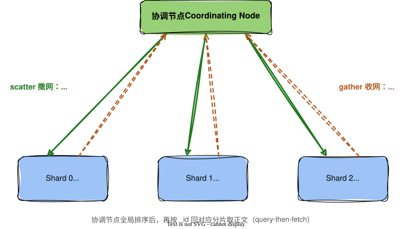

一个文档写进 Elasticsearch，最终会落到某一个分片上。可 `index` 的请求里并没有指定分片，接收请求的节点也不是随手挑一个塞给它。那这条文档到底归哪个分片，是怎么定下来的？

这个问题，牵出了 ES 读写里最值得讲的一条主线：**写是定点，读是广播**。一份数据怎么被切碎、又怎么被拼回来，全藏在这条不对称里。

## 先有「分」：写入是一次定点投递

ES 不会把一个索引（index）存成一坨。它先把索引切成若干个**分片**（shard），每个分片都是一个完整、独立的倒排索引，能单独被搜索，彼此也不知道对方存在。数据装不下、查不动了，就加机器，把分片摊开。所谓「ES 扛得住海量」，根子就是这一刀切下去的。

那一个文档进来，落到哪个分片？不靠中心调度，靠一个确定的公式：

```text
shard = hash(_routing) % number_of_primary_shards
```

`_routing` 默认就是文档的 `_id`。给定 id，算一次 hash、取个模，立刻得到分片编号。这是 O(1) 的定点投递，不用问任何人。写入快，就快在这：它从不「寻找」，它「计算」。

但这行公式有个软肋，还是要命的那种：`number_of_primary_shards` 在分母上。一旦要加分片，分母一变，几乎每个老文档的取模结果都跟着变。A 本来算在 3 号分片，现在算到 7 号，可它人还躺在 3 号，再也找不回来了。**加一个分片，等于让全部存量数据重新洗牌。**

ES 怎么解决？它不解决，它回避：主分片数在建索引那一刻定死，运行期不许改。真要改，只能把数据 `reindex` 进一个新索引，等于重写一遍（后来的 `_split` / `_shrink` 能按倍数增减，但过程要锁只读，本质仍是重组，不是热扩容）。

这套设计看着死板。但换个角度，它其实是一道经典取舍。ES 用的是最朴素的取模哈希：实现简单、分布均匀，代价是刚性，扩容就得全量重映射，于是干脆禁掉。另一条路是 Cassandra 那派的一致性哈希，加节点只迁一小部分数据、能弹性扩容，代价是实现复杂、分布没那么匀。**ES 是拿「弹性扩容」换了「确定、均匀、简单」**，它赌的是规模能在建索引前估对。这不是偷懒，是一种挺清醒的选择。

## 再有「合」：读取是一次广播

写入能定点，是因为 `_id` 攥在手里。可搜索不一样，给定的条件是「标题含某个词」「价格在某区间」，根本不是 `_id`，那行取模公式用不上，ES 压根算不出目标在哪个分片。

算不出，就只能把所有分片都问一遍。这就是 scatter-gather：协调节点把查询撒网（scatter）发给每一个分片，每个分片在自己那份倒排索引里本地查一遍，再把结果收网（gather）汇总回来。写入是「知道目标在哪」的定点，读取是「不知道目标在哪，只能挨个问」的广播——同一套分片，在写和读里待遇天差地别。



广播完还有讲究。ES 默认的搜索分两步走，叫 query-then-fetch：第一步，每个分片只回命中文档的 `_id` 和排序分值，不带正文，协调节点把这些汇总、全局排好序，挑出真正要的那一页；第二步，才拿着这一页的 id 回到对应分片，把完整文档取回来。为什么不一次取全？因为若每个分片都把整页正文传回来，网络要搬的是「分片数 × 页大小」，而其中绝大多数会在排序里被淘汰，纯属白搬。**先要号码，定了再取人。**

理解了这套，有个经典的坑就不再是谜了：深翻页为什么爆内存。要翻到第 10000 页（`from=10000, size=10`），ES 没法只让每个分片交 10 条，它不知道全局第 10000 页落在哪些分片上，只能要求每个分片都返回前 10010 条，协调节点拿到「分片数 × 10010」条，再统一排序、把前面一万条扔掉。翻得越深，每个分片吐得越多、协调节点排得越狠。这不是 bug，是「广播 + 全局排序」的必然账单，也正是 `search_after` 存在的理由。

## 回到那一刀

把这条线收一收：ES 用分片这一刀，在空间上切开了「海量」这个难题。写入靠 routing 精确定位，吃到了这一刀的好处；读取却得 scatter-gather 全局合并，付出了这一刀的代价。**分片对写友好，对读苛刻**，这份不对称是理解 ES 一切读写行为的底座。

可这一刀的代价，还不止「读要广播」这一层。分片越多，scatter-gather 要等的「最慢那一片」越多，延迟被拖住；更隐蔽的是，每个分片的词频是各算各的局部统计，分片越多，相关性打分越失真。精准度，也被这一刀悄悄动了。

于是「分片」这个动作，把三件本来不相干的事摆上了同一张谈判桌：实时性、海量、精准。一句话：**它们争的，其实是同一份资源——数据该被切得多碎。** 这张三选二的桌子，下一篇接着掀。
