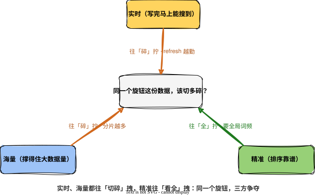

Elasticsearch 想同时做好三件事：**实时**（写完马上能搜到）、**海量**（撑得住大数据量）、**精准**（搜出来的排序靠谱）。麻烦在于，这三件事互相拉扯，越想把一个做到极致，另外两个就越难看。

先说清楚，这不是 CAP 那种被数学证明过的硬定理，没人规定 ES「必须」三选二。它是一种更软、却更普遍的牵扯：这三个诉求，其实在抢同一样东西。要看清这点，得先看它们各自想要什么。

## 三件事，各自要什么

海量靠的是分片。数据一大，就切成多个 `shard` 摊到不同机器上，这是 ES 扛住大体量的根。换句话说，海量要求把数据按空间切开。这条线，[《一份数据怎么被切碎又拼回来》]() 已经讲透。

实时靠的是 refresh。写入先攒在内存，每隔一秒刷出一个新 `segment` 才变得可搜。要更实时，就得刷得更勤，等于把数据按时间切碎，一秒一段，甚至更细。这条线在 [《看得见，不等于存下了》]() 里展开过。

精准要的东西不一样。相关性打分（BM25）靠词频统计：一个词在整个索引里出现得越普遍，区分度越低，权重就越该压下去。注意「整个索引」四个字——**精准要的是一份完整、不被切开的全局视角**。

## 三者争的是同一份资源

把上面三句摆在一起，那条暗线就露出来了：

> 实时要按时间切（refresh 越勤越好），海量要按空间切（分片越多越能扛），精准却要「不切、看全局」。

它们争的，是同一份资源：**这份数据，到底该被切得多碎**。实时和海量都在往「切得更碎」使劲，精准却在往反方向拽。这就是三选二的根——不是三个无关的指标各自难做，是它们在同一个旋钮上往不同方向拧。

## 切开数据，怎么就动了精准

最能说明问题的，是海量和精准这一对。

分片把数据切开后，每个分片是独立的倒排索引，连词频也是各算各的。BM25 打分依赖 `idf`（逆文档频率），而 `idf` 用的文档频率，默认是每个分片在本地统计的。同一个词，在数据多的分片和数据少的分片，算出来的 `idf` 不一样，于是同一份相关度，在不同分片打出的分没法直接比。分片越多、每片数据越少，这种偏差越明显，全局排序就越容易失真。

ES 给了一条补救路：`dfs_query_then_fetch`。它在正式查询前先加一个 DFS 阶段，跨所有分片把词频汇总成全局统计，再拿全局数据打分。精准是救回来了，代价是多一轮网络往返：为了「准」，又搭进去一点「快」。三角的张力，在这里又转了一圈。

不过得说句公道话，这不是「一分片就毁精准」。数据量足够大、分布又均匀时，每个分片的局部词频已经很接近全局，偏差小到可以忽略。真正难受的是数据少、或者路由倾斜（大量文档挤在少数分片）的场景。所以更准确的说法是：**越想要极致的精准，越要为「全局视角」额外付费**，而这笔费用，恰好和海量、实时想省的是同一笔。

实时和海量那条边也一样。refresh 越勤，碎 `segment` 越多，搜索要扫的段越多、后台 merge 压力越大，吞吐和查询效率都被拖着走。想要更新鲜，就得拿吞吐来换。机制在《看得见》里讲过，这里只点一句：碎，是实时的副作用，也是海量的负担。

## 没有标准答案

所以「三选二」从来不是一道有标准答案的题。ES 把几个旋钮交出来：分片数、`refresh_interval`、要不要开 DFS。但它们拧的其实是同一个东西——这份数据，该为哪个诉求多切一刀，为哪个少切一刀。

日志检索要海量和实时，那就接受相关性粗一点；站内商品搜索要精准，那分片别铺太开，必要时认下 DFS 那一轮往返；强一致的实时业务，干脆别拿它当数据库用。

说到底，调优 ES 不是去找一组「最优参数」，而是先想清楚一件事：这三件里，哪一个是当前场景最输不起的。剩下两个，给它让位。
