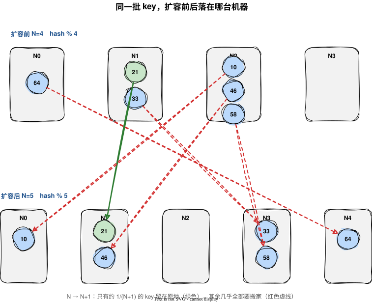
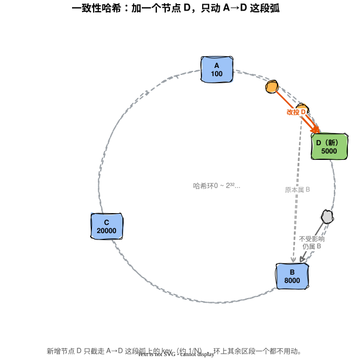
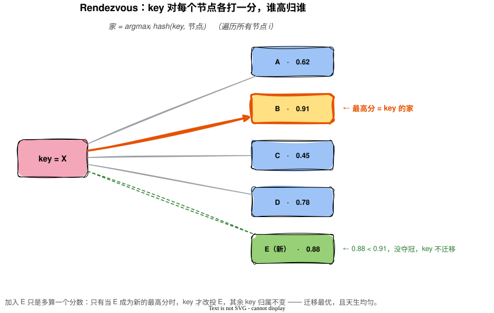

扩容加机器，本该是好事：流量扛不住了，加两台分担一下。可一到分布式存储和缓存这边，加机器常常是最让人头疼的操作——因为它可能触发一场数据大搬家。

一个路由公式选得好不好，平时根本看不出来。所有 key 都能找到自己的家，读写顺畅，岁月静好。真正见真章的是扩容那一刻：节点从 N 台变成 N+1 台，同一个 key，加机器前算出来的家和加机器后算出来的家，还是不是同一台？如果大面积对不上，那对不上的数据就得从旧家搬到新家。搬得越多，扩容的代价越大，甚至要停服。

所以问题可以收得很窄：**扩容的时候，怎么让尽量少的 key 改变归属。** 下面三种哈希算法，就是对这个问题三种不同的回答。

## 一、取模：平时完美，扩容是灾难

最直觉的路由是取模：

```
节点编号 = hash(key) % N
```

`N` 是节点数。算出 key 的哈希，对 N 取余，余几就落到几号节点。

这个公式平时无可挑剔。分布均匀：哈希本身够散，取模后每台机器分到的 key 数量几乎相等；计算极快，一次取余就出结果，O(1)；不占内存，连张表都不用存。要不是有扩容这回事，它几乎是完美的。

软肋恰恰就在扩容。`N` 从 4 变成 5，分母换了，**几乎每个 key 的取模结果都会变**。原来 `hash % 4 = 1` 的 key，现在要算 `hash % 5`，结果大概率不再是 1。算一下就知道有多惨：从 N 台扩到 N+1 台，理论上只有约 `1/(N+1)` 的 key 还能留在原地，其余的全得搬。N 比较大时，这个迁移率逼近 100%。

为什么这么刚性？因为取模是个**全局函数**。N 是公式里的参数，它一变，等于整个映射函数被换掉了，每个 key 都要重新代入新函数算一遍。改一个参数，全局重算。这是取模的命门，记住它，后面两种算法都是在绕开它。



## 二、一致性哈希：把"全局重算"改成"局部邻接"

一致性哈希换了个思路：别让所有 key 都依赖那个会变的 N。

做法是搞一个**环**。把哈希值的取值空间（比如 0 到 2³²）首尾相接，弯成一个圈。然后：

1. 把每个**节点**也哈希一下，按结果落到环上某个位置。比如 A 在 100，B 在 8000，C 在 20000。
2. 把 **key** 哈希到环上。规则是：从 key 的位置**顺时针往前走，撞到的第一个节点，就是它的家。**

关键在扩容那一刻。现在要加一个节点 D，它哈希后落在位置 5000。会发生什么？

只有原本落在 100 到 5000 之间、本来要顺时针跑去找 B(8000) 的那批 key，现在会先撞到 D，改投 D 门下。**环上其它区段，一个 key 都不用动。** B、C 名下那些不经过这段弧的 key，根本不知道有新节点加进来。

平均算下来，加一个节点只迁移约 `1/N` 的数据，而不是取模那种几乎全量。删节点同理：只有它名下的 key 转交给顺时针方向的下一个节点，别人不受影响。

这就是弹性扩容的来源：改动只波及环上相邻的一段弧，不波及全局。



代价也得讲清楚，没有免费的午餐。节点是随机哈希到环上的，落点可能很不均匀：A 和 B 挨得很近，离 C 老远，那 C 名下那段弧就特别长，扛的数据特别多。节点数越少，这种倾斜越严重。

补救办法是**虚拟节点**：让一个物理节点在环上撒几十甚至上百个"分身"，每个分身占一个位置。分身一多，弧段被打得很碎，长短自然平均化，倾斜就被摊平了。但这又带来新的负担：得维护一张"虚拟节点 ↔ 物理机"的映射表，机器上下线时要处理它名下一大批分身的迁移，工程上比一行 `% N` 复杂得多。查询时为了在环上快速找到"顺时针第一个节点"，一般用平衡二叉搜索树存所有（虚拟）节点位置，查一次是 O(log N)，N 是环上节点总数。

一句话：一致性哈希拿弹性换了均匀，再用虚拟节点把均匀勉强补回来。

## 三、Rendezvous：不靠环，也能做到最优迁移

一致性哈希为了均匀，绕了环和虚拟节点一大圈。Rendezvous 哈希（也叫 HRW，Highest Random Weight，最高随机权重）给出了另一种更直接的答案：根本不需要环。

它的规则是：对一个 key，**拿它和每一个节点分别算一个分数**，谁的分数最高，key 就归谁。

```
家 = argmax( hash(key, 节点i) )   遍历所有节点 i
```

注意这里哈希的是 key 和节点的**组合**，所以同一个 key 对不同节点会得到不同的分数。把 N 个分数排个序，取最高的那个节点，就是这个 key 的家。

看扩容会怎样。加一个新节点 E 进来，对每个 key 来说，无非是多算一个分数 `hash(key, E)`，然后看它会不会超过这个 key 原来的最高分。只有"E 的分数恰好成为新的最高分"的那批 key 才会改投 E，其余 key 的最高分没变，归属也不变。迁移同样是最优的，只有该搬到新节点的那部分动了，一个多余的都不搬。



更妙的是它**天生均匀**。每个 key 独立地在所有节点里挑最高分，本质是一次次均匀的随机选择，长期下来各节点分到的 key 数量自然趋于相等，不需要虚拟节点那套补丁。逻辑也简单，没有环、没有映射表要维护。

那它的代价在哪？在查询。取模和一致性哈希定位一个 key 是 O(1) 或 O(log N)，而 Rendezvous **每查一个 key 都要遍历全部 N 个节点算一遍分数**，是 O(N)。节点少的时候这点开销无所谓，节点成百上千时就开始肉疼了。

所以一致性哈希和 Rendezvous 是一组很干净的对照：两者都能做到最优迁移，但**一致性哈希省了查询开销（O(log N)）、却欠下均匀这笔债（要虚拟节点来还）；Rendezvous 天生均匀、不欠债，却把成本压在了每次查询的 O(N) 上。** 一个用空间和复杂度换查询速度，一个用查询速度换简洁和均匀。

补一句它俩的关系：一致性哈希其实可以看成 Rendezvous 的一种特殊情况，把 HRW 的打分规则换成「环上顺时针最近」，两者算出来的归属就完全等价了。反而是这个特殊情况，靠 DynamoDB、Cassandra 这些系统更广为人知。

## 收口：三种算法，其实在回答同一句话

把三种放一起，真正的题眼不在各自的实现细节，而在它们对"key 的家在哪"这个问题的回答方式：

- **取模**问的是一个**全局函数**：`hash(key) % N`。N 是全局参数，一改，所有 key 都得重新代入算。全局重算，所以扩容是灾难。
- **一致性哈希**问的是**环上的邻居**：顺时针撞到的第一个节点是谁。加节点只改变一小段弧的邻居关系，别处的邻居没变，所以只迁一小部分。
- **Rendezvous** 问的是**谁的分最高**：加节点只是多一个竞争者，只有被它抢走最高分的 key 才换家，别的 key 的冠军没变。

取模是全局判定，后两者是局部判定。**把定位从"依赖全局参数的计算"改成"只问局部关系"，正是它们能扛住扩容的根本原因。** 想少搬数据，就别让每个 key 的归属都拴在那个会变的全局 N 上。

最后留个对照。并不是所有系统都选了"弹性扩容"这条路。像 Elasticsearch，主分片数建好就锁死、用取模定路由，宁可放弃在线增减分片，也要换取简单和均匀（它用别的机制去处理扩容，那是另一篇的事）。这恰恰说明：弹性不是天经地义要追求的，它只是一组取舍里的一种。取模换均匀和极简、放弃弹性；一致性哈希和 Rendezvous 换弹性、再各自想办法补回均匀或查询。

一句话：没有免费的扩容，三种哈希只是把账记在了不同的地方。
