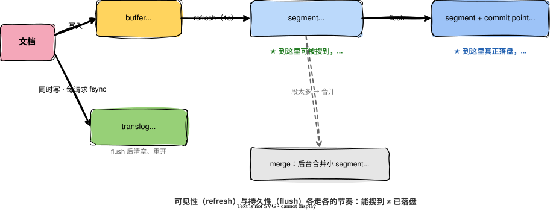

一次写入，最朴素的设想就三步：写进磁盘，能搜了，返回成功。Elasticsearch 偏不这么干。一条数据进来，它先落内存、再写日志、过一秒才变得可搜、攒够了才真正落盘，绕了一大圈。

为什么要这么绕？因为一次写入同时被三个诉求拉扯，而这三个诉求互相打架：

- **快**：要高吞吐，不能每条都老老实实等磁盘。
- **不丢**：宕机了，已经返回成功的数据不许凭空消失。
- **实时**：写完最好立刻就能被搜到。

把它们塞进「写磁盘就返回」这一个动作里，必然顾此失彼。等磁盘 `fsync` 完才返回，稳，但慢；只写内存就返回，快，但一断电全没。ES 的整套写入流程，就是把这三件事拆开，各给一条路走。

## 一次写，兵分几路

文档进来，第一站是内存里的 `buffer`（indexing buffer）。这一步只管快，收下就行。但它有两个短板：`buffer` 里的数据还不能被搜到，而且只在内存里，节点一挂就没了。快是快，「不丢」和「能搜」都还没着落。

所以写 `buffer` 的同时，ES 把这条操作也追加进一个日志文件，`translog`（事务日志）。它的职责只有一个：保命。万一节点在数据落盘前崩了，重启时拿 `translog` 重放一遍，没正式落盘的操作就能找回来。

这里要纠正一个流传很广的说法：「`translog` 默认每 5 秒刷一次盘，所以最多丢 5 秒数据」。这是错的。`translog` 的默认持久化策略是 `request`：每一次写请求，都要等 `translog` 在主分片和所有副本上 `fsync` 落盘之后，才返回成功。换句话说，**默认情况下，已经返回成功的写入不会丢**。那个「5 秒」是把策略改成 `async` 之后才有的行为，是拿安全换吞吐的可选项，不是默认。

快和不丢都有了，还差「能搜」。每隔一秒（`refresh_interval` 默认 1s），ES 做一次 `refresh`：把 `buffer` 里攒下的数据生成一个 `segment`，放进 `filesystem cache`，然后清空 `buffer`。`segment` 一生成，里面的数据就能被搜到了。

但有个细节常被搞错：`refresh` 把 `segment` 放进的是 `filesystem cache`，**不是磁盘**。这一步没有 `fsync`，数据此刻还没真正落盘，持久性仍然全靠那份 `translog` 兜着。`refresh` 只解决「能不能搜到」，不解决「存没存住」。

这正是「近实时」（NRT，near real-time）的来历：写完不是立刻可见，而要等下一次 `refresh`，默认最多 1 秒。ES 不是做不到实时，是它故意把可见性攒批做，省下每写一条就建一个 `segment` 的开销。

`translog` 不能无限涨。攒到阈值或周期性触发时，ES 执行一次 `flush`：把 `filesystem cache` 里的 `segment` 真正 `fsync` 到磁盘，写一个 `commit point` 标记它们已落地，再把旧 `translog` 清掉、重开一个。`flush` 之后数据才真正安全，不必再靠重放。

还剩一个尾巴。一秒一个 `segment`，数量会越积越多，而每次搜索都得把所有 `segment` 扫一遍，碎段太多会拖慢查询。于是后台有个 `merge`，定期把小 `segment` 合并成大的，顺手把那些被标记删除的文档（删除和更新都只是先打删除标记，不立即清理）在合并时真正物理删掉。`merge` 是「实时」省下的开销欠的债，由它在后台慢慢还。

## 看得见，不等于存下了

最后总结一下，ES 写入最值得记住的就一句话：**它把「能被搜到」和「已经落盘」拆成了两件独立的事。**

`refresh` 管可见，`flush` 管持久，两者各走各的节奏，互不绑定。一条数据可能已经能搜到（`refresh` 过了），却还没真正落盘（还没 `flush`）；这段时间里它的安全，是 `translog` 在扛。

所谓「近实时」，不是 ES 偷懒或能力不足，而是它主动把可见性提前、把落盘延后，好让快、不丢、实时这三个冤家不必挤在同一个瞬间里争抢。

这套机制说到底是几个可以拧的旋钮：`refresh_interval` 拧的是实时与吞吐的比例，`translog` 的 durability 拧的是安全与速度的比例。写入这条线，讲的是「实时性」怎么和吞吐、安全做平衡。再往远看，实时性还要和海量、精准放在一起较劲，而这三者往往只能保住两个。是哪两个、又为什么，下一篇细说。
