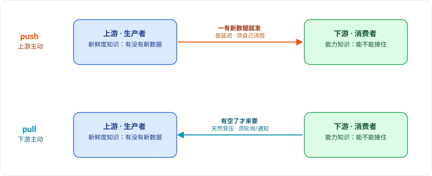

最近在做站内的代码搜索。代码搜索要能用，前提是先把仓库里的代码文件离线索引好，这一步该怎么编排，我参考了 GitLab 的做法——它的精确搜索建在 zoekt 上，几百个索引节点要分活。

调研的时候有个细节我盯了很久：节点拿任务用的是 pull，不是 push。每个节点每隔几秒自己向中心发一个心跳，顺带问一句「有分给我的活吗」，中心把任务塞进这个响应里返回。节点来拉，中心不推。

我的第一反应和很多人一样：pull 不就是轮询吗？没事就去问一遍「好了没」「好了没」，听着就土、就浪费。可越想越觉得，这里用 pull 不仅不土，反而是对的。这篇就顺着这个问题往下挖：push 和 pull 的区别到底在哪，以及为什么这个场景 pull 赢了。

## 它们到底在争什么

push 和 pull，表面上常被定义成「谁向谁发起连接」。这个定义没错，但它是结果，不是原因。真正被决定的是一件更要紧的事：**谁控制数据流动的时机**。

pull 里下游说了算——我什么时候要，数据什么时候动。push 里上游说了算——我什么时候有，数据什么时候动。一个是 consumer-driven，一个是 producer-driven。记住这条，后面所有取舍都从它长出来。

## 两种知识，天生分处两端

为什么时机的归属这么关键？因为有两种知识，天生分处数据流的两端，谁都没法同时拥有。

一种是**新鲜度知识**：有没有新数据、它什么时候到的。这个只有上游知道，数据是它产生的。另一种是**能力知识**：下游现在忙不忙、还吃不吃得下。这个只有下游自己清楚。

push 等于让上游拿着它的新鲜度知识来驱动：一有新数据就发出去，所以延迟低。代价是上游不知道下游能不能接住，得自己额外做流控，否则就把下游冲垮。pull 反过来，让下游拿着它的能力知识来驱动：我有空了才来要，所以天然就有背压，绝不会被硬塞。代价是下游不知道上游有没有新货，只能要么定时去问（轮询，有延迟也有空跑），要么等上游用别的方式通知它。

这就是 push 和 pull 的本质：你让哪一端的本地知识来驱动数据流。剩下的差异，全是这条的推论。

## 从这条根派生的取舍

背压是最直接的一条。pull 的背压是免费的，下游不来要就没有流量；push 想要背压，得自己写限流、盯下游水位、加缓冲队列，一样都不能少。

延迟和新鲜度上 push 赢，而且赢得干脆。数据一就绪就推到，没有「等下一次轮询」的空档。可一旦事件变稀疏，pull 的轮询就成了纯浪费：大半请求都是「有活吗」「没有」。所以这事得看场景——「低频 + 延迟敏感」push 又省又快，「高频 + 能容忍延迟」pull 更稳。

网络这一条常被忽略，却很实在。pull 是下游主动发起连接，于是下游躲在 NAT 或防火墙后面也能用，上游甚至不需要知道下游的地址、不怕它 IP 漂移。push 则要求上游能主动拨到下游，下游必须可达。GitLab 的索引节点跑在 k8s 里，IP 随时在变，这条几乎是决定性的。

还有一条关于「谁记账」。pull 模式下进度通常是下游自己拿着——一个游标、一个 offset，崩了重启从上次的位置接着拉，重放也简单。push 模式下这本账落在上游：发出去到了没、要不要重试、会不会重复，复杂度全归它。

最后一条我觉得最容易被低估：pull 天然把「决策」和「投递」解耦了。因为投递时机归下游，上游就能爱什么时候算就什么时候算。GitLab 正是这么干的——一个独立的定时任务提前把「哪个仓库该索引、归哪个节点」算好、写进库，心跳来了只是把算好的结果取走，当场不做任何分配。

## 真实系统几乎都在混着用

说了这么多，纯 push 或纯 pull 的系统其实很少。混用才是常态，而且混的方式恰好就是想同时拿到两端的知识。

一种是长轮询和流式拉取：下游发起请求（保住背压、穿得过 NAT），但这个请求挂起不立刻返回，一直等到上游有数据才回（于是又拿到了 push 那样的低延迟）。Kafka 消费者的 fetch、SSE、gRPC streaming 都是这个路子。另一种更常见：先 push 一个很小的通知「有新东西了」，下游收到后自己再来 pull 真正的数据。通知走 push 抢延迟，搬运走 pull 保背压。Webhook 喊你「来取吧」、数据库的 CDC，都是这个形状。

这两类混法各自怎么运转、又对应哪些常见框架，我单独写了一篇展开：[《push/pull 不是二选一：信号走推，传输走拉》]()。

## 回到 GitLab

回到开头那个问题：索引为什么用 pull？把上面几条对一遍就清楚了。索引是吞吐型的活，不是延迟型的，一个仓库晚几秒开始建索引没人在乎，pull 的轮询延迟在这里根本不疼；节点在 k8s 里 IP 乱跳，pull 不关心下游网络；几百个节点同时干活，pull 的天然背压正好防止某个慢节点被压垮；再加上调度和心跳解耦，中心可以从容地提前算好分配。每一条都站在 pull 这边。

有意思的是同一个 GitLab，搜索查询那条路绝不会用 pull。用户敲下回车正等着结果，这是延迟敏感的活，你不可能让它去轮询「好了没」，一定是直连、即时返回。

所以 push 还是 pull，从来不是一道有标准答案的题。先问你的负载在乎什么——是延迟，还是控制权；再问哪一端的知识更要紧、更难传过去。答案自然就浮出来了。
